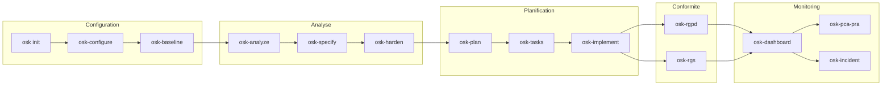

# Commandes

OpenSecKit fournit des slash commands pour Claude Code organisées par phase.

## Vue d'ensemble



## Commandes par Phase

### Phase 0 : Configuration

| Commande | Description | Prérequis |
|----------|-------------|-----------|
| [`osk init`](osk-init.md) | Initialise le projet | - |
| [`/osk-configure`](osk-configure.md) | Configure les principes | `osk init` |
| [`/osk-baseline`](osk-baseline.md) | État des lieux sécurité | `/osk-configure` |

### Phases 1-4 : Analyse par Feature

| Commande | Principes | Livrables |
|----------|-----------|-----------|
| [`/osk-analyze`](osk-analyze.md) | I, II | `threats.md`, `risks.md` |
| [`/osk-specify`](osk-specify.md) | III, IV | `requirements.md`, `testing.md` |
| [`/osk-harden`](osk-harden.md) | V, VI, VII | `hardening.md` |

### Phase 4 : Planification

| Commande | Description | Livrables |
|----------|-------------|-----------|
| [`/osk-plan`](osk-plan.md) | Plan d'implémentation | `plan.md` |
| [`/osk-tasks`](osk-tasks.md) | Tâches ordonnées | `tasks.yaml` |

### Phase 5 : Implémentation

| Commande | Description | Actions |
|----------|-------------|---------|
| [`/osk-implement`](osk-implement.md) | Exécute les tâches | Commits + risk-register |

### Phase 6 : Conformité

| Commande | Domaine | Livrables |
|----------|---------|-----------|
| [`/osk-rgpd`](osk-rgpd.md) | RGPD | Registre, DPIA |
| [`/osk-rgs`](osk-rgs.md) | RGS | EBIOS RM, Homologation |

### Utilitaires

| Commande | Description |
|----------|-------------|
| [`/osk-dashboard`](osk-dashboard.md) | Tableau de bord securite |
| [`/osk-pca-pra`](osk-pca-pra.md) | Plans de continuite |
| [`/osk-incident`](osk-incident.md) | Reponse a incident |

### CLI Scriptables (v3.2.0)

Commandes exécutables en ligne de commande avec sortie JSON pour agents AI.

| Commande | Description | Flag JSON |
|----------|-------------|-----------|
| [`osk check`](osk-check.md) | Vérifier prérequis | `--json` |
| [`osk scaffold`](osk-scaffold.md) | Créer structures fichiers | `--json` |
| [`osk update`](osk-update.md) | Mises à jour mécaniques | `--json` |
| [`osk validate`](osk-validate.md) | Valider cohérence | `--json` |

## Utilisation

Les slash commands s'utilisent dans Claude Code :

```bash
# Lancer Claude Code
claude

# Utiliser une commande
>>> /osk-configure

# Commande avec argument
>>> /osk-analyze "authentication"

# Commande avec option
>>> /osk-rgpd audit
```

## Fichiers Générés

### Dans `.osk/specs/`

Brouillons internes par feature :

```
.osk/specs/
└── 001-authentication/
    ├── threats.md
    ├── risks.md
    ├── requirements.md
    ├── testing.md
    ├── hardening.md
    ├── plan.md
    └── tasks.yaml
```

### Dans `docs/security/`

Documentation finale publiable :

```
docs/security/
├── risks/
│   └── risk-register.yaml
├── incidents/
│   └── INC-*.md
├── rgpd/
│   ├── registre-traitements.md
│   └── dpia-global.md
├── rgs/
│   └── EBIOS-RM-*.md
└── dashboard.md
```
