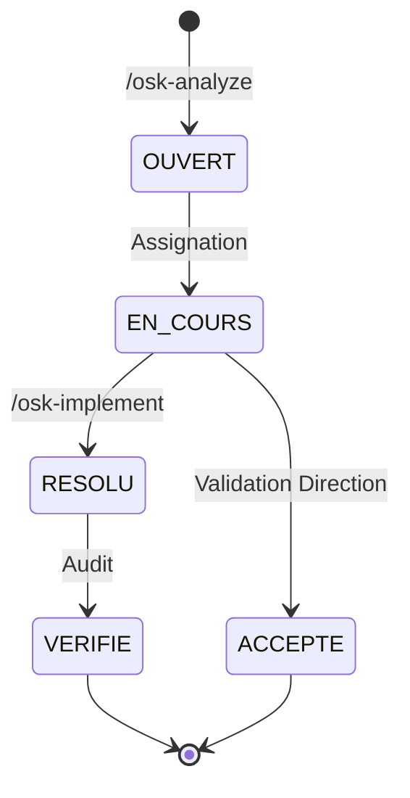

# Risk Register

Le Risk Register est la **source unique de vérité** pour tous les risques du projet.

## Emplacement

```
docs/security/risks/risk-register.yaml
```

!!! warning "Source unique"
    Les fichiers `.osk/specs/*/risks.md` sont des **vues générées** automatiquement depuis le risk-register. Ne les modifiez pas directement.

## Structure

```yaml
# docs/security/risks/risk-register.yaml
metadata:
  version: "3.0.1"
  last_updated: "2025-01-15T14:30:00Z"

stats:
  total: 12
  open: 3
  in_progress: 2
  resolved: 5
  verified: 1
  accepted: 1
  score_total: 450
  score_residuel: 120
  resolution_rate: 58

risks:
  - id: "RISK-AUTH-001"
    source: "/osk-analyze authentication"
    type: "feature"
    feature: "authentication"
    titre: "Brute force sur endpoint login"
    description: "Absence de rate limiting..."

    # Classification
    categorie_stride: "D"
    severite: "CRITIQUE"
    priorite: "P0"

    # Scoring
    impact: 5
    probabilite: 4
    exposition: 5
    score_initial: 100
    score_residuel: 100

    # Localisation
    fichiers:
      - "src/auth/login.ts:45"
    asset_menace: "Endpoint /api/auth/login"
    vecteur_attaque: "Attaque par dictionnaire"

    # Contrôles
    controles_existants: []
    controles_requis:
      - "Rate limiting (max 5 tentatives/min)"
      - "Captcha après 3 échecs"

    # Conformité
    principe_viole: "III"
    cwe: "CWE-307"
    owasp: "A07:2021"

    # Workflow
    statut: "OUVERT"
    dates:
      detection: "2025-01-15"
      echeance: "2025-01-17"  # SLA P0 = 48h

    # Résolution (rempli par /osk-implement)
    resolution:
      commit: null
      pr: null
      description: null
      controles_implementes: []
```

## Workflow des Statuts



### Statuts

| Statut | Description |
|--------|-------------|
| `OUVERT` | Risque détecté, non traité |
| `EN_COURS` | Correction en cours |
| `RESOLU` | Correction implémentée |
| `VERIFIE` | Tests de validation passés |
| `ACCEPTE` | Risque accepté avec justification |

## Scoring

### Formule

```
Score = Impact × Probabilité × Exposition
```

### Échelles

**Impact (1-5)**

| Valeur | Niveau | Description |
|--------|--------|-------------|
| 1 | Négligeable | Pas d'impact business |
| 2 | Mineur | Impact limité |
| 3 | Modéré | Impact significatif |
| 4 | Important | Impact majeur |
| 5 | Critique | Impact catastrophique |

**Probabilité (1-5)**

| Valeur | Niveau | Description |
|--------|--------|-------------|
| 1 | Rare | Exploit complexe |
| 2 | Peu probable | Nécessite expertise |
| 3 | Possible | Exploitable |
| 4 | Probable | Facilement exploitable |
| 5 | Quasi-certain | Exploit public |

**Exposition (1-5)**

| Valeur | Niveau | Description |
|--------|--------|-------------|
| 1 | Isolé | Interne uniquement |
| 2 | Limité | Quelques utilisateurs |
| 3 | Modéré | Utilisateurs internes |
| 4 | Large | Tous les utilisateurs |
| 5 | Public | Internet public |

### Seuils de Priorité

| Priorité | Score | SLA |
|----------|-------|-----|
| P0 | ≥ 80 | 48h |
| P1 | 49-79 | 7 jours |
| P2 | 25-48 | 30 jours |
| P3 | 11-24 | 90 jours |
| P4 | 1-10 | Backlog |

## Commandes

### Ajouter des risques

```bash
>>> /osk-analyze "feature-name"
```

### Résoudre des risques

```bash
>>> /osk-implement "feature-name"
```

### Voir le dashboard

```bash
>>> /osk-dashboard
```

## Métriques

Le risk-register maintient automatiquement les métriques :

| Métrique | Description |
|----------|-------------|
| `total` | Nombre total de risques |
| `score_total` | Somme des scores initiaux |
| `score_residuel` | Somme des scores après mitigation |
| `resolution_rate` | % de risques résolus/vérifiés |
| `mttr` | Mean Time To Resolve (jours) |

## Bonnes Pratiques

!!! tip "Recommandations"
    1. **Un seul fichier** : Ne créez pas plusieurs risk-registers
    2. **Mise à jour atomique** : Utilisez `/osk-implement` pour les transitions
    3. **Traçabilité** : Chaque modification doit être liée à un commit
    4. **Revue régulière** : Utilisez `/osk-dashboard` quotidiennement
