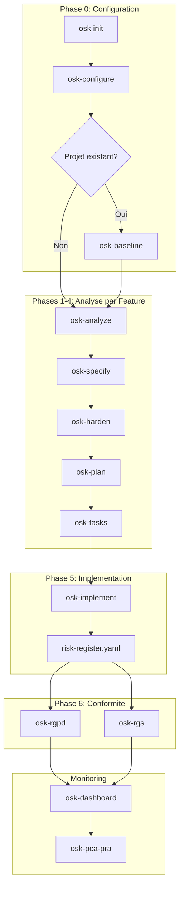
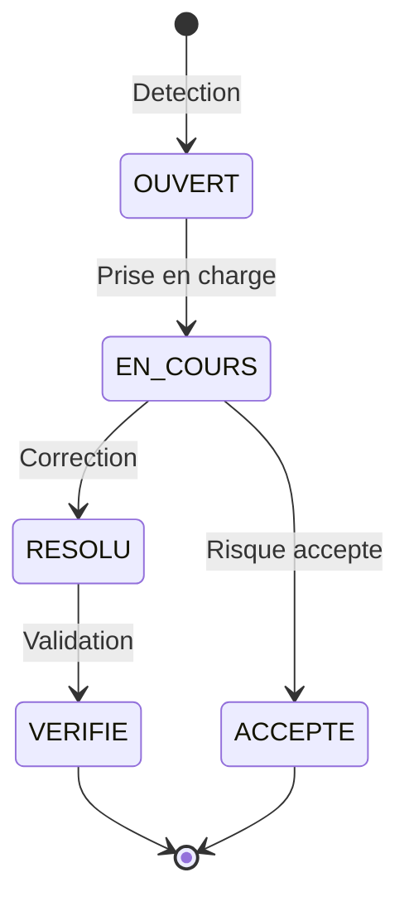

# Workflow OpenSecKit

Le workflow OpenSecKit V3 est conçu pour intégrer la sécurité à chaque étape du développement.

## Vue d'ensemble



## Phase 0 : Configuration

### `osk init`

Initialise le projet avec les fichiers OSK :

```bash
cd mon-projet/
osk init
```

### `/osk-configure`

Analyse le code et configure les principes :

```bash
>>> /osk-configure
```

**Génère :**

- `.osk/memory/context.md` - Faits techniques détectés
- `.osk/memory/constitution.md` - Principes pondérés

### `/osk-baseline` (projets existants)

État des lieux sécurité :

```bash
>>> /osk-baseline
```

**Génère :**

- `.osk/specs/000-baseline/inventory.md` - Inventaire features
- `.osk/specs/000-baseline/features.yaml` - Liste structurée
- `.osk/specs/000-baseline/roadmap.md` - Roadmap sécurité

## Phases 1-4 : Analyse par Feature

Pour chaque feature, exécutez les commandes dans l'ordre :

### `/osk-analyze` - Principes I & II

```bash
>>> /osk-analyze "authentication"
```

**Génère :**

- `threats.md` - Analyse STRIDE
- `risks.md` - Risques scorés
- `risk-register.yaml` - Mise à jour registre

### `/osk-specify` - Principes III & IV

```bash
>>> /osk-specify "authentication"
```

**Génère :**

- `requirements.md` - Exigences de sécurité
- `testing.md` - Stratégie de tests

### `/osk-harden` - Principes V, VI & VII

```bash
>>> /osk-harden "authentication"
```

**Génère :**

- `hardening.md` - Mesures de durcissement

### `/osk-plan` & `/osk-tasks`

```bash
>>> /osk-plan "authentication"
>>> /osk-tasks "authentication"
```

**Génère :**

- `plan.md` - Plan consolidé
- `tasks.yaml` - Tâches ordonnées

## Phase 5 : Implémentation

### `/osk-implement`

Exécute les tâches et met à jour le risk-register :

```bash
>>> /osk-implement "authentication"
```

**Actions :**

1. Lit `tasks.yaml`
2. Exécute chaque tâche séquentiellement
3. Crée un commit par tâche
4. Met à jour `risk-register.yaml` automatiquement

**Options :**

| Option | Description |
|--------|-------------|
| `--auto` | Sans confirmation |
| `--dry-run` | Affiche sans modifier |
| `--task T001` | Exécute une tâche spécifique |

## Phase 6 : Conformité

### `/osk-rgpd`

```bash
>>> /osk-rgpd        # Configuration
>>> /osk-rgpd audit  # Audit
```

### `/osk-rgs`

```bash
>>> /osk-rgs         # Configuration
>>> /osk-rgs renew   # Ré-homologation
```

## Monitoring

### `/osk-dashboard`

```bash
>>> /osk-dashboard
```

Affiche :

- Score de conformité aux 7 principes
- État des risques (ouverts, en cours, résolus)
- Recommandations prioritaires

### `/osk-pca-pra`

```bash
>>> /osk-pca-pra
```

Génère les plans de continuité et reprise d'activité.

## Workflow des Risques



Chaque transition est tracée avec :

- Commit/PR de la correction
- Contrôles implémentés
- Date et auteur
- Justification (si accepté)
