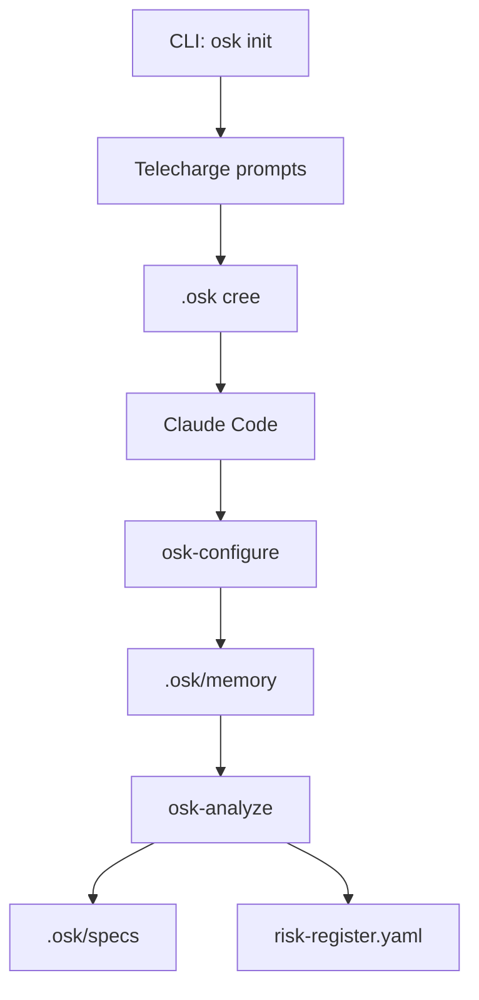

# Architecture

Architecture technique d'OpenSecKit.

## Vue d'ensemble

```
OpenSecKit/
├── cli/                    # CLI Rust
│   └── src/
│       ├── main.rs
│       ├── agents.rs       # Gestion multi-agent
│       ├── prompts.rs      # Parsing des prompts
│       └── commands/
│           ├── init.rs
│           └── ingest.rs
│
├── agents.toml             # Configuration des agents (data-driven)
│
├── prompts/                # Prompts sources (slash commands)
│   ├── osk-configure.md
│   ├── osk-analyze.md
│   └── ...
│
├── templates/              # Templates réutilisables
│   ├── agents/            # Templates Tera par agent
│   │   ├── claude-code.tera
│   │   ├── copilot.tera
│   │   ├── cursor.tera
│   │   ├── gemini.tera
│   │   └── AGENTS.md.tera
│   ├── schemas/           # Structures YAML
│   ├── outputs/           # Templates fichiers
│   └── reports/           # Rapports terminal
│
├── domaines/              # Domaines réglementaires
│   ├── rgpd/
│   ├── gouvernement-rgs/
│   └── nis2/
│
├── docs/                  # Documentation (MkDocs)
│
└── scripts/               # Scripts de dev/test
```

## CLI Rust

Le CLI est écrit en Rust pour la performance et la portabilité.

### Commandes

| Commande | Description |
|----------|-------------|
| `init` | Initialise un projet |
| `ingest` | Exporte le contexte |

### Dépendances principales

- `clap` - Parsing arguments
- `reqwest` - HTTP client (blocking)
- `toml` - Parsing config
- `tera` - Moteur de templates
- `regex` - Parsing frontmatter
- `which` - Détection agents installés

## Prompts

Les prompts sont des fichiers Markdown avec frontmatter :

```markdown
---
description: Description de la commande
argument: feature_name
---

# Rôle

Tu es le **Security Analyst**...

# Templates

**Charger depuis `.osk/templates/` :**
- `schemas/risk-entry.yaml`
- `outputs/threats.md.tmpl`

# Processus

1. Étape 1
2. Étape 2
...
```

### Principes de design

1. **Léger** - ~100 lignes max
2. **Référencement** - Templates externes
3. **Structuré** - Processus clair en phases

## Templates

### Schemas

Définissent les structures de données :

```yaml
# schemas/risk-entry.yaml
id: "RISK-[FEATURE]-[NNN]"
titre: "[Titre]"
score_initial: 1-125
statut: "OUVERT"
```

### Outputs

Templates Handlebars pour fichiers générés :

```handlebars
# {{title}}

{{#each items}}
## {{name}}
{{/each}}
```

### Reports

Rapports ASCII pour le terminal.

## Architecture Multi-Agent

OpenSecKit utilise une architecture **data-driven** pour supporter plusieurs agents AI sans duplication de code.

### agents.toml

Configuration déclarative des agents :

```toml
[meta]
version = "3.1.0"
default_agent = "claude-code"

[agents.claude-code]
name = "Claude Code"
format = "slash-command"        # Un fichier par commande
output_dir = ".claude/commands"
file_pattern = "{command}.md"
template = "claude-code.tera"
enabled = true

[agents.copilot]
name = "GitHub Copilot"
format = "single-file"          # Toutes commandes dans 1 fichier
output_file = ".github/copilot-instructions.md"
template = "copilot.tera"
enabled = true

[universal]
enabled = true
output_file = "AGENTS.md"
template = "AGENTS.md.tera"
```

### Formats de sortie

| Format | Description | Exemple |
|--------|-------------|---------|
| `slash-command` | Un fichier par commande | Claude Code |
| `single-file` | Toutes commandes dans 1 fichier | Copilot, Gemini |
| `rules-dir` | Une règle par commande | Cursor |

### Templates Tera

Les templates dans `templates/agents/` transforment les prompts sources en format spécifique à chaque agent.

Variables disponibles :

- `prompts` - Liste des PromptInfo
- `prompt.name`, `prompt.description`, `prompt.argument`
- `prompt.principles`, `prompt.steps`, `prompt.outputs`
- `prompt.raw_content` - Contenu brut du prompt
- `version` - Version OpenSecKit
- `domains.rgpd`, `domains.rgs`, `domains.nis2`

### Ajouter un nouvel agent

1. Ajouter une section dans `agents.toml` :
```toml
[agents.mon-agent]
name = "Mon Agent"
format = "single-file"
output_file = ".mon-agent/instructions.md"
template = "mon-agent.tera"
enabled = true
```

2. Créer le template `templates/agents/mon-agent.tera`

3. Aucun changement de code Rust requis

## Domaines

Chaque domaine contient :

- `README.md` - Documentation
- `skeleton.yaml` - Structure de config
- Templates spécifiques (DPIA, EBIOS, etc.)

## Flux de données



## Tests

```bash
# Test local complet
./scripts/test-local.sh

# Vérification liens
./scripts/check-links.sh

# Tests Rust
cargo test
```
