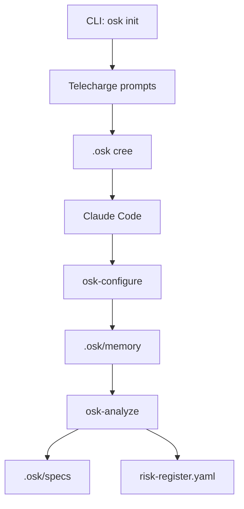

# Architecture

Architecture technique d'OpenSecKit.

## Vue d'ensemble

```
OpenSecKit/
├── cli/                    # CLI Rust
│   └── src/
│       ├── main.rs
│       └── commands/
│           ├── init.rs
│           └── ingest.rs
│
├── prompts/                # Prompts (slash commands)
│   ├── osk-configure.md
│   ├── osk-analyze.md
│   └── ...
│
├── templates/              # Templates réutilisables
│   ├── schemas/           # Structures YAML
│   ├── outputs/           # Templates fichiers
│   └── reports/           # Rapports terminal
│
├── domaines/              # Domaines réglementaires
│   ├── rgpd/
│   ├── gouvernement-rgs/
│   └── nis2/
│
├── docs/                  # Documentation (MkDocs)
│
└── scripts/               # Scripts de dev/test
```

## CLI Rust

Le CLI est écrit en Rust pour la performance et la portabilité.

### Commandes

| Commande | Description |
|----------|-------------|
| `init` | Initialise un projet |
| `ingest` | Exporte le contexte |

### Dépendances principales

- `clap` - Parsing arguments
- `tokio` - Async runtime
- `reqwest` - HTTP client
- `toml` - Parsing config

## Prompts

Les prompts sont des fichiers Markdown avec frontmatter :

```markdown
---
description: Description de la commande
argument: feature_name
---

# Rôle

Tu es le **Security Analyst**...

# Templates

**Charger depuis `.osk/templates/` :**
- `schemas/risk-entry.yaml`
- `outputs/threats.md.tmpl`

# Processus

1. Étape 1
2. Étape 2
...
```

### Principes de design

1. **Léger** - ~100 lignes max
2. **Référencement** - Templates externes
3. **Structuré** - Processus clair en phases

## Templates

### Schemas

Définissent les structures de données :

```yaml
# schemas/risk-entry.yaml
id: "RISK-[FEATURE]-[NNN]"
titre: "[Titre]"
score_initial: 1-125
statut: "OUVERT"
```

### Outputs

Templates Handlebars pour fichiers générés :

```handlebars
# {{title}}

{{#each items}}
## {{name}}
{{/each}}
```

### Reports

Rapports ASCII pour le terminal.

## Domaines

Chaque domaine contient :

- `README.md` - Documentation
- `skeleton.yaml` - Structure de config
- Templates spécifiques (DPIA, EBIOS, etc.)

## Flux de données



## Tests

```bash
# Test local complet
./scripts/test-local.sh

# Vérification liens
./scripts/check-links.sh

# Tests Rust
cargo test
```
